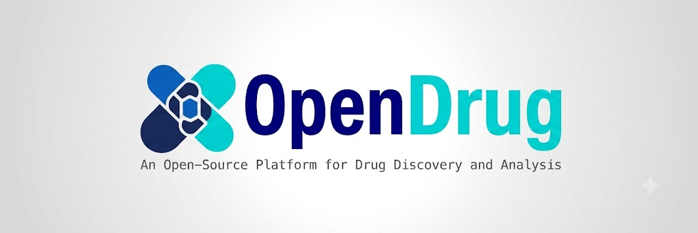

<div align="center">
  
</div>

<p align="center">
  <a href="https://opendrug.readthedocs.io/">Docs</a> •
  <a href="#quick-start">Quick Start</a> •
</p>

# OpenDrug

## <span id="quick-start">🚀 Quick Start</span>

Follow these steps to get started with OpenDrug:

### **Step 1: Clone the Repository**

```
git clone <REPO-URL>
```

### **Step 2: Install Dependencies**

#### General Dependencies

You can install the general dependencies:

```
conda env create -f opendrug.yml
```

### **Step 3: Run the Main Script**

After installing the dependencies, you can run the main script using the following command:

```
python main.py --model <model_name> --matrix <matrix_name> --modality <modality_name> --epochs <epochs> --batch <batch>
```

#### Optional arguments:

- `--model <model_name>`: Model choice, e.g., `MRCGNN`, `GOGNN`, `ZeroDDI`, `TIGER`, `MVA`, `MUFFIN`, `CASTER`, `MMDGDTI`, `MKGFENN`, etc.
- `--matrix <matrix_name>`: Interaction matrix, e.g., `binary`, `ChCh-Miner`, `Ryus`, `Dengs`, `zeroddi`, `multilabel`, `twosides`, etc.
- `--modality <modality_name>`: Modality types, e.g., `smiles`, `sequence`, `3d`, `mechanism`, `text`, `drkg`, etc. (can specify multiple)
- `--epochs <epochs>`: Number of epochs to run.
- `--batch <batch>`: The batch size to use.

Note that the above list includes only a subset of the available parameters. For more parameters and their descriptions, please refer to the `openddi/parms_setting.py` file.

### Example Command:

To run the **MRCGNN** model on the **Ryus** DDI dataset with **smiles sequence 3d mechanism text** modalities, you can run the following command:

```
python openddi/main.py --model MRCGNN --matrix Ryus --modality smiles sequence 3d mechanism text --epochs 100 --batch 4096
```

This command will:

- Use the **MRCGNN** model
- Use the **Ryus** dataset
- Use the **smiles sequence 3d mechanism text** modalities
- Train for **100 epochs** with a **batch size of 4096**
